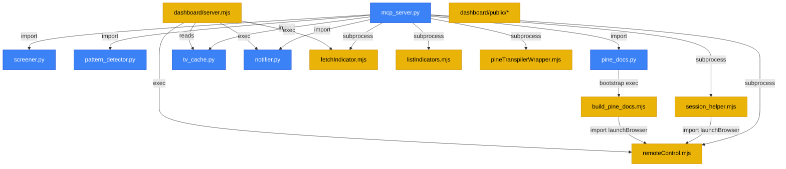

# BRIDGE_ARCH_AUDIT.md — TV-Oracle-Bridge Architectural Audit

> **Audit Date:** 2026-06-12
> **Scope:** Full codebase analysis — 15 source files, 1 dashboard SPA, 2 container configs
> **Objective:** Map responsibilities, identify debt, define boundaries, recommend integration order

---

## 1. File Responsibility Map

### 1.1 Core Bridge Layer (Node.js)

| File | Responsibility | LoC | Risk Profile |
|:---|:---|:---:|:---:|
| `fetchIndicator.mjs` | WebSocket oracle: connects to TV, subscribes to study data stream, materializes periods/plots/graphic/tables/strategyReport/chartOhlc into `out/<key>.json` | 191 | **High** — process-level exception handler, timeout-based snapshot, single-shot exit |
| `remoteControl.mjs` | Playwright browser automation: screenshot capture, chart macro execution (change_symbol, toggle_drawings, save), public script downloader, Canvas annotation overlay | 462 | **High** — 3 distinct responsibilities in one file, selector fragility, hardcoded constants |
| `listIndicators.mjs` | Enumerates authenticated user's private TV indicators via `@mathieuc/tradingview` | 31 | Low |
| `session_helper.mjs` | Interactive browser session cookie refresher (visible window + stdin prompt + .env rewrite) | 141 | Medium — writes to `.env`, duplicates browser launch logic from `remoteControl.mjs` |
| `build_pine_docs.mjs` | Playwright sitemap crawler for Pine Script v6 reference manual → `pine_docs_db.json` | 293 | Medium — depends on TV DOM structure, imports `launchBrowser` from remoteControl |
| `pineTranspilerWrapper.mjs` | AGPL-safe subprocess wrapper for `@luxalgo/pinets` transpiler | 73 | Low — clean isolation boundary |
| `apply-lib-patch.mjs` | `postinstall` hook patching `@mathieuc/tradingview` parser for oversized chunks | 80 | Low |

### 1.2 Service Layer (Python)

| File | Responsibility | LoC | Risk Profile |
|:---|:---|:---:|:---:|
| `mcp_server.py` | FastMCP gateway: registers 11 tools, orchestrates subprocess calls to Node.js scripts, coordinates Python modules | 312 | **Critical** — monolithic orchestrator, growing tool count, no input validation beyond type hints |
| `screener.py` | TradingView scanner API client: 4 hardcoded presets (top_volume, top_gainers, oversold, overbought), markdown table output | 137 | Medium — rigid query model, no custom field/operator support |
| `tv_cache.py` | SQLite OHLCV cache: init_db, save_bars, get_cached_bars, merge_and_update_cache, delta-sync logic | 178 | Medium — `init_db()` called on every function entry (redundant), no connection pooling |
| `pine_docs.py` | Offline Pine docs lookup + static linter with `difflib` typo suggestion | 196 | Low — clean, self-contained |
| `pattern_detector.py` | Candlestick pattern classifier (Doji, Hammer, Shooting Star, Engulfing) on OHLC arrays + annotation generator for Playwright | 203 | Low |
| `notifier.py` | Webhook dispatcher: Discord + Telegram via `urllib.request`, manual multipart/form-data construction | 149 | Medium — manual boundary construction is fragile for non-PNG files |

### 1.3 Dashboard (Express + Vanilla SPA)

| File | Responsibility | LoC | Risk Profile |
|:---|:---|:---:|:---:|
| `dashboard/server.mjs` | Express REST API: status, screenshots, indicators, docs search, script download proxy, background caching daemon (start/stop/status/logs) | 358 | Medium — daemon state is in-memory only (lost on restart), mixes API routing with daemon logic |
| `dashboard/public/index.html` | SPA shell: sidebar nav, 5 tab panels (Overview, Screenshots, Indicators, Pine Docs, Downloader), lightbox modal | 336 | Low |
| `dashboard/public/app.js` | Client-side JS: tab switching, API data loading (status/screenshots/indicators/docs), daemon control UI, download form handler | 714 | Medium — large monolithic file, no error boundary patterns |
| `dashboard/public/style.css` | Premium dark theme design system (CSS custom properties, neon aesthetic, responsive layout) | 1075 | Low |

### 1.4 Configuration & Infrastructure

| File | Responsibility |
|:---|:---|
| `package.json` | Node deps: `@mathieuc/tradingview`, `dotenv`, `express`, `playwright`, `sqlite3` |
| `requirements.txt` | Python deps: `mcp>=0.1.0` (sole external dependency — all other Python is stdlib) |
| `indicators.json` | Public indicator key→name registry |
| `indicators.local.json` | Private pineId/version mapping (gitignored) |
| `.env` / `.env.example` | Session credentials, browser config, webhook URLs |
| `Dockerfile` | MS Playwright image + Node + Python, exposes port 8000 |
| `docker-compose.yml` | Single service, maps `out/` and `indicators.local.json`, port 8000 |

---

## 2. MCP Tools Registry (Current State)

| # | Tool Name | Signature | Backend | Description |
|:--:|:---|:---|:---:|:---|
| 1 | `fetch_indicator` | `(key, range_val, wait_ms)` | Node subprocess | Fetch indicator data via WebSocket, merge with SQLite cache |
| 2 | `list_indicators` | `()` | Node subprocess | Enumerate user's private indicators |
| 3 | `capture_screenshot` | `(symbol, timeframe, name)` | Node subprocess | Chart screenshot with candlestick annotations |
| 4 | `refresh_session_credentials` | `()` | Node subprocess | Interactive browser login for cookie refresh |
| 5 | `run_screener` | `(market, condition, limit)` | Python in-process | Query TV scanner API |
| 6 | `detect_patterns` | `(key)` | Python in-process | Candlestick pattern analysis on cached data |
| 7 | `get_pine_docs` | `(function_name)` | Python in-process | Offline Pine Script documentation lookup |
| 8 | `validate_pine_code` | `(code)` | Python in-process | Static Pine Script linter |
| 9 | `transpile_pine_script` | `(file_path)` | Node subprocess | AGPL-safe PineTS transpilation |
| 10 | `download_public_script` | `(script_url, output_name)` | Node subprocess | Extract source from public TV script pages |
| 11 | `control_chart_macro` | `(action_type, value, symbol, interval)` | Node subprocess | Remote chart control macros |
| 12 | `send_notification` | `(message, filepath)` | Python in-process | Discord/Telegram webhook dispatcher |

**Observation:** 12 tools in a single 312-line file. Not yet at the "must refactor" threshold, but approaching it. The real concern is not file size but **testability** — there are zero automated tests.

---

## 3. Extension Points (Where to Add, Not Where to Replace)

### 3.1 Screener Layer
- `screener.py` has a clean `run_screener()` function with a simple signature. **Best extension point:** introduce a `screener_core.py` providing arbitrary query builder, keep `screener.py` as backward-compatible CLI/preset wrapper. The MCP tool `run_screener` can be extended with an optional `custom_query` parameter while keeping preset defaults.

### 3.2 Dashboard REST API
- `dashboard/server.mjs` already has a clean route registration pattern. New routes can be added without restructuring. **Key gap:** no `/api/health` endpoint, no run metadata persistence, no screener API proxy.

### 3.3 MCP Server Modularity
- `mcp_server.py` imports are well-scoped. Each tool is a standalone `@mcp.tool()` decorated function. **Extension point:** tools can be extracted into `tools/*.py` modules and imported without changing the registration pattern, if/when the file exceeds ~20 tools.

### 3.4 Remote Control
- `remoteControl.mjs` exports 3 distinct functions (`captureChartScreenshot`, `executeChartMacro`, `downloadPublicScript`) plus internal `launchBrowser` and `annotateScreenshot`. **Extension point:** `launchBrowser` is already reused by `session_helper.mjs` and `build_pine_docs.mjs`. Any hardening should happen at this function level.

### 3.5 Cache Layer
- `tv_cache.py` provides a clean insert/retrieve/merge API around SQLite. **Extension point:** add run metadata table (timestamps, durations, error counts) without touching the bars schema.

---

## 4. Technical Debt Inventory

### 4.0 Security Vulnerabilities (P0 — Fix Before Any Feature Work)

| ID | Severity | Location | Issue | Vector |
|:--:|:---:|:---|:---|:---|
| S1 | 🔴 CRITICAL | `dashboard/server.mjs` L223, L286 | **Command injection** — user-supplied `url` and `filename` interpolated directly into shell commands via template literals without sanitization | Remote (dashboard API) |
| S2 | 🔴 HIGH | `dashboard/public/app.js` (throughout) | **XSS via innerHTML** — server-returned data (indicator names, doc entries, filenames) injected directly via `.innerHTML` template literals | Stored XSS |
| S3 | 🟠 HIGH | `dashboard/server.mjs` L156 | **Path traversal** — `/api/indicators/:key` joins `req.params.key` into file path without sanitizing `../` sequences | Remote (API) |
| S4 | 🟠 HIGH | `pineTranspilerWrapper.mjs` L26 | **Shell injection** — `spawn` with `shell: true` and user-controlled `pineFilePath` | MCP tool input |
| S5 | 🟡 MEDIUM | `remoteControl.mjs` L18-23 | **Weakened browser security** — `--disable-web-security` and `--disable-features=IsolateOrigins` in launch args | Automation context |
| S6 | 🟡 MEDIUM | `session_helper.mjs` L124 | **Plaintext credential storage** — session cookies written unencrypted to `.env` | Local file access |

> [!CAUTION]
> **S1 (command injection) and S3 (path traversal) are exploitable from any client that can reach the dashboard port.** These must be patched before any new feature integration.

### 4.1 Critical Debt

| ID | Location | Issue | Impact |
|:--:|:---|:---|:---|
| D1 | `mcp_server.py` | **Zero automated tests** — no pytest, no smoke tests, no regression suite | Cannot validate changes safely |
| D2 | `screener.py` | **Hardcoded 4-preset query model** — cannot query arbitrary fields/operators | Blocks advanced screener integration |
| D3 | `remoteControl.mjs` | **3 responsibilities in one file** (screenshot, macro, downloader) with shared browser launch | Coupling risk, testing difficulty |
| D4 | `tv_cache.py` | `init_db()` called on every function entry — opens/closes connection per call, no pooling | Performance on high-frequency access |

### 4.2 Medium Debt

| ID | Location | Issue | Impact |
|:--:|:---|:---|:---|
| D5 | `mcp_server.py` | **No input validation** beyond Python type hints — e.g. `file_path` in `transpile_pine_script` accepts any string | Security surface for path traversal |
| D6 | `dashboard/server.mjs` | **Daemon state is in-memory** — restart loses running status, interval, logs | Operator confusion |
| D7 | `notifier.py` | **Manual multipart boundary** construction — works for PNG but fragile for other file types | Silent failures on non-image uploads |
| D8 | `fetchIndicator.mjs` | **Timeout-based snapshot** (`setTimeout(finish, WAIT_MS)`) — no way to know if data is complete vs. partially streamed | Data completeness uncertainty |
| D9 | `remoteControl.mjs` | **Hardcoded selector strings** (`div.chart-markup-table`, `canvas.interactive-playground`) — break on TV DOM updates | Silent screenshot failures |
| D10 | `dashboard/public/app.js` | **714-line monolithic client** — no module separation, no error boundaries | Maintenance difficulty |
| D11 | All Python files | **Repeated UTF-8 stdout reconfigure boilerplate** (6 files) | Code smell, should be centralized |
| D12 | `docker-compose.yml` | **Exposes port 8000** but dashboard runs on port 5000; no dashboard port mapping | Cannot access dashboard from container |

### 4.3 Low Debt

| ID | Location | Issue |
|:--:|:---|:---|
| D13 | `session_helper.mjs` | Duplicates browser launch config already in `remoteControl.mjs` (imports `launchBrowser` but overrides headless) |
| D14 | `build_pine_docs.mjs` | Commented-out count limiter (line 212-215), dead test code left in |
| D15 | `requirements.txt` | Only lists `mcp>=0.1.0` — does not pin version, no sqlite3 listing (stdlib) |
| D16 | `pattern_detector.py` | Duplicated pattern detection logic between `analyze_ohlc_patterns` and `get_candlestick_annotations` — same calculations, different output format |

---

## 5. Architectural Boundaries — What TV-Oracle-Bridge IS and IS NOT

### 5.1 IS (Bounded Context Definition)

```
TV-Oracle-Bridge is a SERVICE LAYER that:
  ├── Extracts data FROM TradingView (WebSocket, scanner API, browser DOM)
  ├── Transforms it into normalized local formats (JSON, SQLite, PNG)
  ├── Exposes it TO AI agents via MCP tools
  ├── Provides debug/admin tooling via a local dashboard
  └── Sends operational notifications via webhooks
```

### 5.2 IS NOT (Anti-Patterns to Avoid)

| Anti-Pattern | Risk | Boundary Rule |
|:---|:---|:---|
| TradingView Terminal Clone | Dashboard becomes a trading UI with charting, watchlists, portfolio | Dashboard must stay admin/debug console only |
| Duplicate Analytics Engine | Pattern detector, screener, Pine runtime grow into analysis platform | Keep pattern detection simple; advanced analytics belong in CycleLab |
| Monolithic MCP Megaserver | mcp_server.py grows to 50+ tools covering non-bridge concerns | Only tools that extract/transform/transport TV data belong here |
| User-Facing Product | Dashboard gets auth, multi-user, workspace persistence | Zero user management; single-operator, localhost-only |
| Data Pipeline | Cache layer grows into data warehouse with ETL, scheduling, backfill | SQLite cache is ephemeral acceleration, not source of truth |

### 5.3 Boundary Tests (Questions to Ask Before Adding a Feature)

1. **Does it extract, transform, or transport TradingView data?** → YES: belongs here
2. **Does it analyze or interpret data for trading decisions?** → NO: belongs in CycleLab
3. **Does it serve end-users directly?** → NO: belongs in CycleLab frontend
4. **Does it manage user state, sessions, or preferences beyond TV cookies?** → NO: out of scope
5. **Does it duplicate a capability already in CycleLab Terminal?** → NO: out of scope

---

## 6. Risks of Scope Creep (Terminal Transformation)

| Signal | Current Status | Threshold |
|:---|:---|:---|
| Dashboard UI complexity | 5 tabs, vanilla SPA, no auth | ⚠️ At limit — no more product-facing tabs |
| MCP tool count | 12 tools | OK — refactor at 20+ |
| Python dependencies | 1 (`mcp`) | ✅ Excellent — keep minimal |
| Node dependencies | 5 (`tradingview`, `dotenv`, `express`, `playwright`, `sqlite3`) | ✅ Reasonable |
| File count in root | 28 source files | ⚠️ Getting busy — consider `lib/` or `src/` if adding >5 more |
| Lines of code total | ~4,000 (excluding generated/node_modules) | ✅ Manageable |

---

## 7. Recommended Integration Order

Based on the audit findings, here is the recommended phasing:

### Phase 1: Advanced Screener Layer (HIGH VALUE, LOW RISK)
**Why first:** The current screener is the weakest module — only 4 hardcoded presets, no custom queries, no multi-market support. The TradingView-Screener library proves the API supports arbitrary field/condition/operator queries. This delivers immediate capability expansion with minimal architectural risk.

**Approach:** Adapter pattern — new `screener_core.py` + `screener_presets.py`, keep `screener.py` as backward-compatible wrapper.

### Phase 2: Dashboard Technical Console (MEDIUM VALUE, MEDIUM RISK)
**Why second:** The dashboard is functional but missing operational panels (health, session validation, screener form, notifier test, run logs). These are debug/admin tools that directly serve the bridge operator. Adding them makes the bridge self-diagnosable.

**Approach:** Extend existing Express routes + add corresponding UI panels. No new frameworks.

### Phase 3: Offline Pine Runtime Spike (EXPERIMENTAL, ISOLATED)
**Why third:** This is a capability investigation, not a production feature. It determines whether offline Pine execution adds real value for test/validation workflows. Must stay isolated (`offline_pine_runtime.py`) with zero coupling to the main bridge path.

**Approach:** Pure spike — PoC module, compatibility report, go/no-go decision.

### Phase 4: Remote Control Hardening (MEDIUM VALUE, LOW RISK)
**Why fourth:** The remote control works today but has known fragilities (selector hardcoding, no retry logic, no structured state). Fixing these prevents future breakage rather than adding new capabilities.

**Approach:** Audit failure modes, add timeout/retry, standardize screenshot metadata, extract browser abstraction if warranted.

### Phase 5: MCP Modularization (LOW VALUE UNLESS NEEDED)
**Why last:** The MCP server is not yet at the complexity threshold where modularization pays off. Only do this if Phase 1–4 push the tool count above 20 or if test isolation becomes a blocking problem.

**Approach:** Extract tool functions into `tools/*.py` modules, keep `mcp_server.py` as registration hub.

---

## 8. Cross-Cutting Improvements (Apply Alongside Any Phase)

| Improvement | Priority | Effort |
|:---|:---:|:---:|
| Add `pytest` test suite skeleton with smoke tests for each MCP tool | **P0** | 2h |
| Centralize UTF-8 stdout reconfigure into a shared `bridge_utils.py` | P2 | 30m |
| Add `/api/health` endpoint to dashboard server | P1 | 30m |
| Persist run metadata (timestamps, durations, error counts) in SQLite | P1 | 2h |
| Add input validation (path traversal, URL format) to MCP tools | P1 | 1h |
| Fix docker-compose to map dashboard port 5000 | P2 | 10m |
| Standardize JSON output envelope for CycleLab consumption | P1 | 1h |
| Add structured logging (JSON format) to replace scattered `print()` | P2 | 2h |

---

## Appendix A: Dependency Graph



## Appendix B: File Inventory Checksums

| File | Size | Lines |
|:---|---:|---:|
| `mcp_server.py` | 12,680 B | 312 |
| `screener.py` | 5,120 B | 137 |
| `notifier.py` | 6,025 B | 149 |
| `pine_docs.py` | 7,633 B | 196 |
| `tv_cache.py` | 5,690 B | 178 |
| `pattern_detector.py` | 8,874 B | 203 |
| `fetchIndicator.mjs` | 6,844 B | 191 |
| `remoteControl.mjs` | 16,509 B | 462 |
| `session_helper.mjs` | 4,631 B | 141 |
| `build_pine_docs.mjs` | 12,368 B | 293 |
| `pineTranspilerWrapper.mjs` | 2,181 B | 73 |
| `listIndicators.mjs` | 1,138 B | 31 |
| `apply-lib-patch.mjs` | 2,509 B | 80 |
| `dashboard/server.mjs` | 12,790 B | 358 |
| `dashboard/public/index.html` | 15,512 B | 336 |
| `dashboard/public/app.js` | 25,214 B | 714 |
| `dashboard/public/style.css` | 19,295 B | 1,075 |
| **Total (source only)** | **~165 KB** | **~4,929** |
