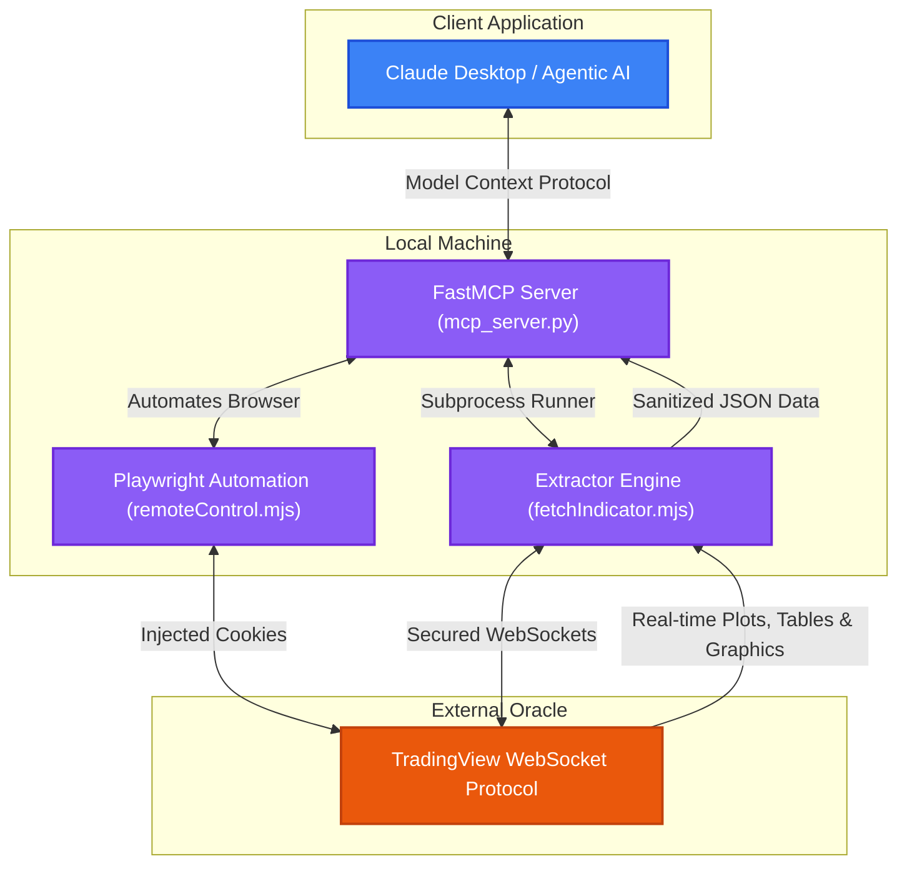

# 📈 TV Oracle Bridge

<div align="center">

[](LICENSE)
[](https://nodejs.org/)
[](https://python.org)
[](https://modelcontextprotocol.io/)

<p align="center">
  <strong>An elegant, offline TradingView indicator oracle and FastMCP Server</strong><br />
  Bridges real-time TradingView study executions (plots, graphic objects, strategies) to local AI agents and quantitative analysis scripts.
</p>

</div>

---

## 🎯 Quick Capabilities (What You Can Do)

* 🖥️ **Interactive Web Dashboard**: Launch a premium dark-mode console on port `5000` to review database stats, browse screenshot libraries, search docs, download public scripts, and manage backends.
* 🔄 **Automated Cache Daemon**: Schedule background delta-sync cycles to auto-refresher your indicators, reporting status via webhooks.
* 📡 **Fetch Indicator Data**: Stream computed plots, strategy logs, and drawing tables into SQLite and JSON files (`npm run fetch`).
* 📜 **List Private Indicators**: Discover and list private/invite-only indicators saved under your account (`npm run list`).
* 📸 **Capture Chart Screenshots**: Save high-resolution chart PNGs with custom indicators and drawing overlays (`node remoteControl.mjs`).
* 🔍 **Market Technical Screening**: Scan global crypto, forex, and stock symbols by technical states (`python screener.py`).
* 🕯️ **Candlestick Pattern Scanner**: Detect pattern formations (Hammer, Engulfing, Doji) on historical feeds (`python pattern_detector.py`).
* 🤖 **AI Agent Integration**: Expose all functionalities (including documentation autocomplete, spellchecker, and notifier) via FastMCP server gateway.

### 📸 Chart Screenshot Preview
Here is an example of a high-resolution chart snapshot captured programmatically using the built-in browser controller:


---

## 🗺️ System Architecture

The **TV Oracle Bridge** connects to TradingView's secure WebSockets, streams computed indicator periods/plots and drawing tables, and exposes them locally via a unified JSON format or a **Model Context Protocol (MCP)** server.



---

## ✨ Codebase Breakdown (How it Works)

This standalone project integrates multiple components to bridge the gap between TradingView's client-side runtime and your local python/agentic environment:

1. **`fetchIndicator.mjs` (WebSocket Extractor)**: Connects to TradingView's WebSockets to stream computed indicator plots, strategies, tables, and drawing labels into local SQLite/JSON formats.
2. **`remoteControl.mjs` (Browser Automator)**: Uses Playwright to launch browser sessions (e.g. Brave/Chrome), navigate charts, execute remote commands, download scripts, and capture screenshots.
3. **`dashboard/` (Local Web Dashboard)**: Express backend (`server.mjs`) and SPA client (`public/`) offering status overviews, image sliders, indicator inspector, autocomplete docs search, script downloader panel, and daemon managers.
4. **`notifier.py` (Webhook Notifier)**: Native Python module to dispatch text alerts and screenshot file attachments to Discord and Telegram.
5. **`screener.py` (Market Scanner)**: Scans global tickers for volume spikes, oversold levels, and top gainers using official API scanners.
6. **`pattern_detector.py` (Candlestick Classifier)**: Offline analyzer evaluating candlestick patterns (Doji, Hammer, Engulfing) on cached database bars.
7. **`pine_docs.py` (Linter & Autocomplete)**: Offline Pine Script v5/v6 syntax checker featuring typo-correction suggestions via `difflib`.
8. **`build_pine_docs.mjs` (Sitemap Crawler)**: Playwright sitemap scraper compiling documentation into a rich 800+ function database (`pine_docs_db.json`).
9. **`pineTranspilerWrapper.mjs` (Safe TS Transpiler)**: Isolates `@luxalgo/pinets` compiler runs to maintain 100% license independence from AGPL-3.0.
10. **`mcp_server.py` (FastMCP Gateway)**: Exposes all scraper, scanner, and control tools to local AI agents.
11. **`Dockerfile` & `docker-compose.yml` (Docker Stack)**: Containerizes Node/Python/Playwright for simple multi-platform background deployment.

---

## 🚀 Step-by-Step Setup

### 1. Prerequisites
Ensure you have the following installed:
* [Node.js](https://nodejs.org/) `>= 18.0.0`
* [Python](https://python.org/) `>= 3.10`
* [Docker](https://www.docker.com/) *(optional, for containerized deployment)*

### 2. Installation
Clone the repository and install the Node.js and Python dependencies:
```bash
git clone https://github.com/andreafinazziinfo/TV-Oracle-Bridge.git
cd TV-Oracle-Bridge
npm install
pip install -r requirements.txt
```
> 💡 *Note: The Node.js installation automatically executes `apply-lib-patch.mjs` to patch the underlying WebSocket parser, making it resilient to malformed/oversized strategy payload chunks.*

### 3. Session Credentials (`.env`)
Create your local environment file:
```bash
cp .env.example .env
```
Open `.env` and fill in your TradingView session credentials:
* `TV_SESSION`: The value of your `sessionid` cookie.
* `TV_SESSION_SIGN`: The value of your `sessionid_sign` cookie.

*Optional Webhook Notification Settings (for daemon logs & screenshots)*:
* `TV_NOTIFIER_DISCORD_WEBHOOK`: Full URL of a Discord channel webhook.
* `TV_NOTIFIER_TELEGRAM_TOKEN`: HTTP API Token from Telegram BotFather.
* `TV_NOTIFIER_TELEGRAM_CHAT_ID`: Destination Chat ID for the Telegram bot.

*Optional Browser Configuration (e.g., to use your local Brave Browser installation)*:
```ini
TV_BROWSER_TYPE=chromium
TV_BROWSER_PATH=C:/Users/Andrea/AppData/Local/BraveSoftware/Brave-Browser/Application/brave.exe
TV_BROWSER_HEADLESS=true
```

> 🔍 **How to get cookies**: Log in to `tradingview.com`, open Developer Tools (`F12`), go to **Application** -> **Cookies** -> `https://www.tradingview.com`, and find `sessionid`.

### 4. Config Private Indicators (`indicators.local.json`)
Since this is a public repository, private indicator IDs are stored in a local, uncommitted file.
Create your local config file:
```bash
cp indicators.local.example.json indicators.local.json
```
Edit `indicators.local.json` and insert your invite-only or private indicator IDs:
```json
{
  "completa": {
    "pineId": "USER;your_indicator_id_here",
    "version": "630.0"
  }
}
```
> 💡 *To discover your private indicators, run the helper command:*
> ```bash
> npm run list
> ```

---

## 🛠️ Usage Guide

### 1. Fetching Indicator Data
Extract computed values directly into the `out/` folder:
```bash
node fetchIndicator.mjs <key> [range] [waitMs]
```
* **`key`**: The indicator key defined in `indicators.json` (e.g. `completa`, `model_entry`).
* **`range`**: Number of historical bars to load (default: `5000`).
* **`waitMs`**: Streaming wait time before writing snapshot (default: `20000`ms).

Example:
```bash
node fetchIndicator.mjs completa 5000 20000
```

### 2. Capturing Chart Screenshots
Take high-resolution snapshots of your chart layouts:
```bash
node remoteControl.mjs screenshot <symbol> <timeframe> [output_name.png]
```
Example:
```bash
node remoteControl.mjs screenshot BINANCE:BTCUSDT 60 btc_chart.png
```

### 3. Running the Technical Screener
Scan technical setups across different markets:
```bash
python screener.py <market> <condition> [limit]
```
* **`market`**: `crypto`, `forex`, `america` (stocks).
* **`condition`**: `top_volume`, `top_gainers`, `oversold` (RSI < 30), `overbought` (RSI > 70).

Example:
```bash
python screener.py crypto oversold 15
```

### 4. Scanning Candlestick Patterns
Detect candlestick patterns on historical price data:
```bash
python pattern_detector.py [path_to_fetched_json_file]
```
Example:
```bash
python pattern_detector.py out/completa.json
```

### 5. Running the Local Web Dashboard & Daemon
Launch the premium web console to inspect indicator caches, view screenshots, look up documentation, download open-source scripts, and manage background caching refresher cycles:
```bash
npm run dashboard
# or: node dashboard/server.mjs
```
Open your browser and navigate to **`http://localhost:5000`** to access:
* **Overview & Status**: Review SQLite database stats, masked environment variable configuration, and control/monitor the **Background Caching Auto-Refresher Daemon** with live log streaming.
* **Screenshot Gallery**: A visual drawer featuring a fullscreen lightbox slider for all captured chart layouts.
* **Indicator Database**: Interactive explorer to inspect raw JSON parameters, inputs, and historical series records.
* **Pine Script Docs**: Query a comprehensive dictionary of Pine Script v5/v6 functions, complete with parameter descriptions, examples, and syntax.
* **Script Downloader**: Paste public TradingView script detail URLs to fetch and extract code formatting, saving the result under `out/downloads/`.

### 6. Crawling Pine Docs
To compile or refresh the local offline Pine Script docs database (`pine_docs_db.json`), run the optimized Playwright crawler:
```bash
node build_pine_docs.mjs
```
This script scans official sitemaps, resolves duplicates, and downloads structured function specifications (syntax, parameters, examples, return values) for 800+ unique identifiers.

---
## 🤖 Running the MCP Server

Launch the FastMCP server to integrate these tools with your AI client (like Claude Desktop):
```bash
python mcp_server.py
```

### Registered Tools Exposed to AI:
1. `fetch_indicator`: Fetch indicator outputs & strategy logs from WebSocket.
2. `list_indicators`: Enumerate user's private indicators.
3. `capture_screenshot`: Take visual chart screenshots (uses Playwright + Brave/Chrome).
4. `control_chart_macro`: Execute a remote macro on the active chart layout (change symbol, toggle drawings, save).
5. `run_screener`: Scan markets for specific technical states.
6. `detect_patterns`: Classify candlestick setups on historical OHLC bars.
7. `get_pine_docs`: Get syntax guidelines for Pine Script functions.
8. `validate_pine_code`: Run static linting checks on custom Pine code.
9. `transpile_pine_script`: Compiles Pine code into local JS using the AGPL-safe wrapper.
10. `send_notification`: Dispatch text summaries and screenshot file attachments to Discord and Telegram.

### Configuration for Claude Desktop (`claude_desktop_config.json`):
```json
{
  "mcpServers": {
    "tv-oracle-bridge": {
      "command": "python",
      "args": ["/path/to/TV-Oracle-Bridge/mcp_server.py"],
      "env": {
        "PYTHONPATH": "/path/to/TV-Oracle-Bridge"
      }
    }
  }
}
```

---

## ⚖️ Disclaimer

> [!WARNING]
> This is an unofficial utility and is not affiliated, associated, authorized, endorsed by, or in any way officially connected with TradingView, Inc., or any of its subsidiaries or affiliates. Use this tool responsibly and in accordance with TradingView's terms of service.
