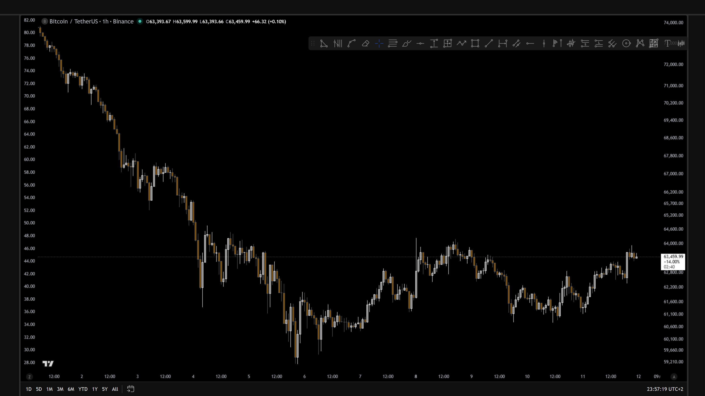
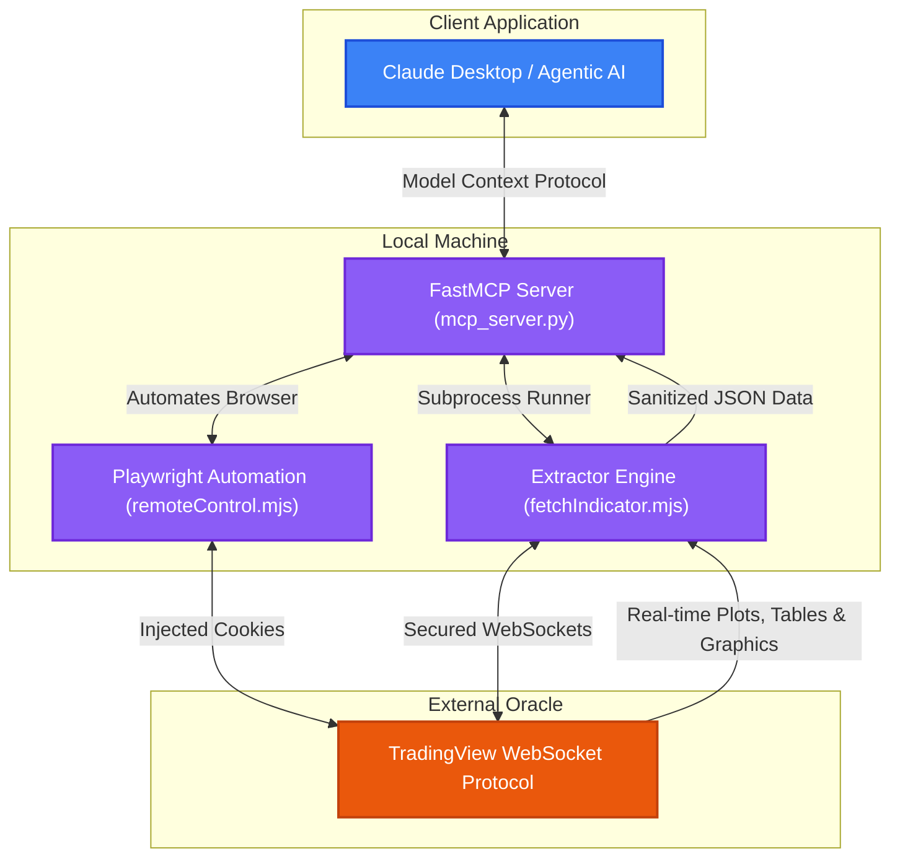

# 📈 TV Oracle Bridge

<div align="center">

[](LICENSE)
[](https://nodejs.org/)
[](https://python.org)
[](https://modelcontextprotocol.io/)

<p align="center">
  <strong>An elegant, offline TradingView indicator oracle and FastMCP Server</strong><br />
  Bridges real-time TradingView study executions (plots, graphic objects, strategies) to local AI agents and quantitative analysis scripts.
</p>

<p align="center">
  
</p>

</div>

---

## 🎯 Quick Capabilities (What You Can Do)

* 🖥️ **Interactive Web Dashboard**: Launch a premium dark-mode console on port `5000` to review database stats, browse screenshot libraries, search docs, download public scripts, and manage backends.
* 🔄 **Automated Cache Daemon**: Schedule background delta-sync cycles to auto-refresher your indicators, reporting status via webhooks.
* 📡 **Fetch Indicator Data**: Stream computed plots, strategy logs, and drawing tables into SQLite and JSON files (`npm run fetch`).
* 📜 **List Private Indicators**: Discover and list private/invite-only indicators saved under your account (`npm run list`).
* 📸 **Capture Chart Screenshots**: Save high-resolution chart PNGs with custom indicators and drawing overlays (`node remoteControl.mjs`).
* 📅 **Macro Calendars & News Feed**: Retrieve economic event calendars and real-time news headlines via Yahoo Finance RSS integrations.
* 📊 **Structured Data Extraction**: Intercept and extract raw JSON data for Options chains, Market Heatmaps, and Bond Yield Curves (`node remoteControl.mjs extract`).
* 🔔 **Instant Alert Webhooks**: Receive and log real-time TradingView price or study alerts (`POST /api/alerts`) and forward them instantly to Discord/Telegram.
* 💻 **Pine AST Compiler Check**: Perform programmatic Pine Script compilation validation via integrated PineTS linter checks.
* 🧪 **Local Pine Script Sandbox**: Compile, transpile, and run Pine Script indicators (using PineTS) and strategies (using PineForge Docker) offline. Render candlestick charts, volume histograms, custom plot lines, and buy/sell entry/exit markers visually using Lightweight Charts.
* 🔍 **Market Technical Screening**: Scan global crypto, forex, and stock symbols by technical states (`python screener.py`).
* 🕯️ **Candlestick Pattern Scanner**: Detect pattern formations (Hammer, Engulfing, Doji) on historical feeds (`python pattern_detector.py`).
* 🤖 **AI Agent Integration**: Expose all functionalities (including documentation autocomplete, spellchecker, and notifier) via FastMCP server gateway.

### 📸 Chart Screenshot Preview
Here is an example of a high-resolution chart snapshot captured programmatically using the built-in browser controller:



---

## 🗺️ System Architecture

The **TV Oracle Bridge** connects to TradingView's secure WebSockets, streams computed indicator periods/plots and drawing tables, and exposes them locally via a unified JSON format or a **Model Context Protocol (MCP)** server.



---

## ✨ Codebase Breakdown (How it Works)

This standalone project integrates multiple components to bridge the gap between TradingView's client-side runtime and your local python/agentic environment:

1. **`fetchIndicator.mjs` (WebSocket Extractor)**: Connects to TradingView's secure WebSocket feed using `@mathieuc/tradingview`. Streams real-time plot series (`study.periods`) and interactive UI drawing elements (tables, lines, labels, boxes), outputting identical values as the browser runtime.
2. **`remoteControl.mjs` (Browser Automator & Annotator)**: Harnesses Playwright to automate TradingView charts. Controls chart assets, layouts, and indicators. Features a **Canvas overlay engine** that highlights candlestick patterns, handles chart macro executions (including timeframe change and clearing drawings), and extracts structured JSON details (Options, Heatmaps, Yield curves) using browser request interception.
3. **`dashboard/` (Local Web Technical Console)**: An Express backend (`server.mjs`) and SPA client (`public/`) running on port `5000`. Features real-time status widgets, cookie expiration countdowns, SQLite stats inspectors, a documentation viewer, an open-source script downloader, and background cache logs. It now exposes `/api/alerts` for webhook ingestion and `/api/extract/:type` for structured data extraction.
4. **`notifier.py` (Webhook Notifier)**: A zero-dependency Python helper that utilizes `urllib` to dispatch rich Markdown embeds and snapshot image attachments to Discord channels and Telegram bot chats.
5. **`screener.py` / `screener_core.py` / `screener_presets.py` (Advanced Screener)**: Queries TradingView's official scanner endpoints. Features **23 pre-configured technical presets** (Momentum, Mean Reversion, Volume, consensus, etc.) and allows arbitrary JSON-based multi-filter scanner builds.
6. **`pattern_detector.py` (Candlestick Classifier)**: Evaluates cached historical OHLCV candles to detect patterns (Hammer, Doji, Shooting Star, Bullish/Bearish Engulfing) using a private, unified scanning routine.
7. **`pine_docs.py` (Linter & Reference)**: Offline documentation lookup with spelling autocorrect (via `difflib` Gestalt Pattern Matching) and a syntax checker detecting v4-obsolete keywords, missing namespaces (e.g. `rsi` -> `ta.rsi` in v5/v6), and unmatched brackets. It now integrates a programmatic compilation validator.
8. **`build_pine_docs.mjs` (Sitemap Crawler)**: Playwright crawler that scrapes TradingView's Pine Script v6 sitemap and extracts sitemap parameters for 800+ functions, generating a local sitemap file (`pine_docs_db.json`).
9. **`pineTranspilerWrapper.mjs` (Safe TS Transpiler)**: Programmatically integrates the `pinets` transpiler library to perform Pine Script compilation validation check, complying with licensing constraints.
10. **`transpiler_helper.mjs` (Standalone Indicator Compiler)**: Wraps `@opus-aether-ai/pine-transpiler` to translate Pine Script indicators into standalone, self-contained JavaScript factory strings.
11. **`scripts/run_strategy_ffi.py` (Python ctypes FFI)**: Python bridge utilizing `ctypes` to run compiled C++ strategy binaries on JSON OHLCV inputs, returning full trade logs and statistics.
12. **`tv_cache.py` (SQLite Cache & Telemetry)**: Configured in **WAL (Write-Ahead Logging) mode** for database concurrency safety. Maintains data tables for indicator series and runs metadata (`runs` table) and runs an eviction policy (`cleanup_old_bars`) to limit disk space.
13. **`Dockerfile` & `docker-compose.yml` (Docker Orchestrator)**: Containerizes Node/Python/Playwright for automated background runs, mapping ports `5000` and `8000` while mounting persistent database volumes.

---

## ⚙️ Advanced Features & System Internals

### 1. SQLite WAL Cache & Delta Syncing
To prevent data drift and avoid overloading TradingView's WebSockets, `tv_cache.py` saves historical values to `out/tv_oracle_cache.db`.
* **WAL Mode**: Enabled by default (`PRAGMA journal_mode = wal`) for concurrent write safety.
* **Delta Syncing**: Before starting a WebSocket stream, the system checks the database for the newest cached bar timestamp. If present, it requests only a small subset (e.g., last 100 bars) and merges the new data, reducing streaming wait times from **20 seconds to 8 seconds**.
* **Eviction Policy**: Automatically purges historical records older than a configured limit (`cleanup_old_bars(max_age_days=90)`) to maintain database performance.
* **Run Telemetry**: Log stats for every fetch (duration, row counts, delta-sync status, errors) are saved in the `runs` table, queryable via the MCP tool `get_run_history`.

### 2. Canvas Chart Annotator
When screenshots are requested with pattern detection active:
1. Playwright captures the standard chart PNG layout.
2. `pattern_detector.py` evaluates the candle database and extracts coordinates.
3. Playwright loads the screenshot inside a canvas element on a temporary page.
4. An HTML5 Canvas script draws translucent highlight blocks and colored flags identifying Doji, Hammer, and Engulfing patterns, saving the annotated PNG.

### 3. Session Refresher & Cookie Manager
When cookies expire, `session_helper.mjs` automates credential refreshes:
* Spawns a visible browser window (using Brave or Chrome as configured in `.env`).
* Prompts the user to log in and solve captchas/2FA.
* Extracts `sessionid` and `sessionid_sign`, performs a validation request to the TradingView status API, and updates `.env` with file permissions set to `0o600` for security.

### 4. Advanced 23-Preset Technical Screener
The Python screener includes a query builder (`screener_core.py`) mapped to 23 high-performance presets defined in `screener_presets.py`:
* **Momentum & Trend**: `momentum_breakout`, `trend_following`, `golden_cross`, `death_cross`.
* **Mean Reversion & Oscillators**: `mean_reversion`, `stoch_oversold`, `stoch_overbought`, `cci_extreme_low`, `cci_extreme_high`.
* **Volume & Accumulation**: `whale_accumulation` (volume > 3x avg), `high_volatility`, `low_volatility_squeeze`, `unusual_volume`.
* **Consensus & Performance**: `strong_buy_consensus` (Recommend.All > 0.5), `strong_sell_consensus`, `weekly_performers`, `monthly_losers`.
* **Cycle-Optimized Reversals**: `cycle_reversal_long`, `cycle_reversal_short`, and `divergence_scan`.

### 5. Premium Dashboard Console Extensions
The technical dashboard includes 4 advanced console extensions to improve operations and observability:
* **Custom Screener Presets Manager**: Add, update, or remove technical scanning layouts directly from the web console. Custom configurations are persisted in `screener_presets.local.json` and automatically loaded in the Python screener script and overview scan dropdown.
* **Automated Session Expiry Alerts**: A background agent runs every 6 hours to check if the TradingView cookie session has expired. If invalid, it dispatches an alert via the Discord or Telegram webhook notify subsystems. The alert flag resets automatically upon cookie renewal.
* **Screenshot Pattern Detections & Filtering**: Captured annotated chart screenshots automatically output a `.json` sidecar metadata file with pattern detections. The gallery tab integrates a dropdown selector to filter screenshot thumbnails by detected pattern (Doji, Hammer, Engulfing).
* **Consolidated Live System Logs Console**: Consolidates stdout and daemon outputs in an auto-scrolling, terminal-like console window on the dashboard for real-time diagnostics, with quick copy-to-clipboard functionality.

### 6. Local Sandbox & Offline Execution Engines
The Web Dashboard includes a fully interactive local sandbox pane to prototype and validate indicator and strategy logic offline:
* **JS Indicator Evaluation**: Uses `pinets` and `@opus-aether-ai/pine-transpiler` on the server to execute study code directly on loaded historical bars, outputting numerical curves plotted natively via Lightweight Charts.
* **C++ Strategy Simulations**: Spawns containerized compiler environments running `pineforge-codegen` inside Docker, returning complete performance reports (Sharpe ratios, drawdown curves, win rate splits) and drawing entries/exits directly on the candles.
* **Interactive Charting Workspace**: Features an integrated code editor (left pane), dataset toggler, status badge console, and a responsive charting canvas (right pane) visualizing price data, histograms, and indicators simultaneously.

---

## ↳ Step-by-Step Setup

### 1. Prerequisites
Ensure you have the following installed:
* [Node.js](https://nodejs.org/) `>= 18.0.0`
* [Python](https://python.org/) `>= 3.10`
* [Docker](https://www.docker.com/) *(optional, for containerized deployment)*

### 2. Installation
Clone the repository and install the Node.js and Python dependencies:
```bash
git clone https://github.com/andreafinazziinfo/TV-Oracle-Bridge.git
cd TV-Oracle-Bridge
npm install
pip install -r requirements.txt
```
> 💡 *Note: The Node.js installation automatically executes `apply-lib-patch.mjs` to patch the underlying WebSocket parser, making it resilient to malformed/oversized strategy payload chunks.*

### 3. Session Credentials (`.env`)
Create your local environment file:
```bash
cp .env.example .env
```
Open `.env` and fill in your TradingView session credentials:
* `TV_SESSION`: The value of your `sessionid` cookie.
* `TV_SESSION_SIGN`: The value of your `sessionid_sign` cookie.

*Optional Webhook Notification Settings (for daemon logs & screenshots)*:
* `TV_NOTIFIER_DISCORD_WEBHOOK`: Full URL of a Discord channel webhook.
* `TV_NOTIFIER_TELEGRAM_TOKEN`: HTTP API Token from Telegram BotFather.
* `TV_NOTIFIER_TELEGRAM_CHAT_ID`: Destination Chat ID for the Telegram bot.

*Optional Browser Configuration (e.g., to use your local Brave Browser installation)*:
```ini
TV_BROWSER_TYPE=chromium
TV_BROWSER_PATH=C:/Users/Andrea/AppData/Local/BraveSoftware/Brave-Browser/Application/brave.exe
TV_BROWSER_HEADLESS=true
```

> 🔍 **How to get cookies**: Log in to `tradingview.com`, open Developer Tools (`F12`), go to **Application** -> **Cookies** -> `https://www.tradingview.com`, and find `sessionid`.

### 4. Config Private Indicators (`indicators.local.json`)
Since this is a public repository, private indicator IDs are stored in a local, uncommitted file.
Create your local config file:
```bash
cp indicators.local.example.json indicators.local.json
```
Edit `indicators.local.json` and insert your invite-only or private indicator IDs:
```json
{
  "completa": {
    "pineId": "USER;your_indicator_id_here",
    "version": "630.0"
  }
}
```
> 💡 *To discover your private indicators, run the helper command:*
> ```bash
> npm run list
> ```

---

## 🛠️ Usage Guide

### 1. Fetching Indicator Data
Extract computed values directly into the SQLite database and `out/` folder:
```bash
node fetchIndicator.mjs <key> [range] [waitMs]
```
* **`key`**: The indicator key defined in `indicators.json` (e.g. `completa`, `model_entry`).
* **`range`**: Number of historical bars to load (default: `5000`).
* **`waitMs`**: Streaming wait time before writing snapshot (default: `20000`ms).

Example:
```bash
node fetchIndicator.mjs completa 5000 20000
```

### 2. Capturing Chart Screenshots (with Canvas Overlays)
Take high-resolution snapshots of your chart layouts:
```bash
node remoteControl.mjs screenshot <symbol> <timeframe> [output_name.png] [annotations_json]
```
Example:
```bash
node remoteControl.mjs screenshot BINANCE:BTCUSDT 60 btc_chart.png '[{"barIndexFromRight": 2, "color": "rgba(255,0,0,0.15)", "label": "Bearish Engulfing"}]'
```

### 3. Running the Technical Screener
Scan technical setups across different markets:
```bash
python screener.py <market> <condition> [limit]
```
* **`market`**: `crypto`, `forex`, `america` (stocks).
* **`condition`**: Any of the 23 presets (e.g., `whale_accumulation`, `cycle_reversal_long`, `oversold`).

Example:
```bash
python screener.py crypto cycle_reversal_long 15
```

### 4. Scanning Candlestick Patterns
Detect candlestick patterns on historical price data:
```bash
python pattern_detector.py [path_to_fetched_json_file]
```
Example:
```bash
python pattern_detector.py out/completa.json
```

### 5. Running the Local Web Dashboard & Daemon
Launch the web console to inspect caches, screenshots, documentations, and manage background auto-refresher daemon cycles:
```bash
npm run dashboard
```
Open **`http://localhost:5000`** to access:
* **Overview & Status**: System health, masked env variables, and the **Background Caching Auto-Refresher Daemon** panel.
* **Screenshot Gallery**: High-resolution lightbox viewer for chart layouts.
* **Indicator Database**: Split-pane raw JSON explorer and data inspector.
* **Pine Script Docs**: Query tool searching 800+ v5/v6 functions offline.
* **Script Downloader**: Download and sanitize open-source scripts into `.pine` files.

### 6. Executing Unit Test Suites
The project includes a robust test framework checking Python modules and Express API endpoints:
```bash
npm test
```
This script runs:
1. **Python tests (`pytest`)**: 24 tests validating screeners, caching database operations, notifier dispatching, pattern classification, and path sanitizers.
2. **Node.js tests (`node --test`)**: 58 tests validating CLI scripts, Playwright configurations, cookie parsers, all Express endpoints (utilizing `supertest`), and the Local Sandbox transpilation/execution logic (82 total tests, ALL PASS).

---
## 🤖 Running the MCP Server

Launch the FastMCP server to integrate these tools with your AI client (like Claude Desktop):
```bash
python mcp_server.py
```

### Registered Tools Exposed to AI:
1. `fetch_indicator`: Fetch indicator outputs & strategy logs from WebSocket.
2. `list_indicators`: Enumerate user's private indicators.
3. `capture_screenshot`: Take visual chart screenshots (uses Playwright + Brave/Chrome).
4. `control_chart_macro`: Execute a remote macro on the active chart layout (change symbol, toggle drawings, save, change timeframe, or clear all drawings).
5. `run_screener`: Scan markets for specific technical states.
6. `detect_patterns`: Classify candlestick setups on historical OHLC bars.
7. `get_pine_docs`: Get syntax guidelines for Pine Script functions.
8. `validate_pine_code`: Run static linting checks on custom Pine code.
9. `transpile_pine_script`: Compiles Pine code into local JS using the AGPL-safe wrapper.
10. `send_notification`: Dispatch text summaries and screenshot file attachments to Discord and Telegram.
11. `get_economic_calendar`: Retrieve upcoming economic event calendars.
12. `get_market_news`: Fetch real-time market news summaries for asset tickers.
13. `get_structured_market_data`: Intercept and extract structured JSON market data (Options chains, heatmaps, bond yield curves).

### Configuration for Claude Desktop (`claude_desktop_config.json`):
```json
{
  "mcpServers": {
    "tv-oracle-bridge": {
      "command": "python",
      "args": ["/path/to/TV-Oracle-Bridge/mcp_server.py"],
      "env": {
        "PYTHONPATH": "/path/to/TV-Oracle-Bridge"
      }
    }
  }
}
```

---

## ⚖️ License & Trademark

This project is licensed under the Apache License, Version 2.0. See the [LICENSE](LICENSE) file for details.

### Trademark Disclaimer

TradingView is a trademark of TradingView, Inc. This project is independent, self-hosted, and unaffiliated with, endorsed by, or sponsored by TradingView, Inc. or any of its partners.

TV Oracle Bridge interacts with user-controlled local sessions and automation flows. It does not claim to be an official TradingView product. Users are responsible for complying with applicable platform terms and local laws.
