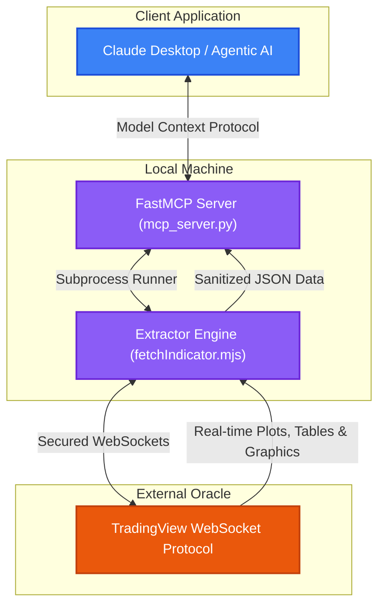

# 📈 TV Oracle Bridge

<div align="center">

[](LICENSE)
[](https://nodejs.org/)
[](https://python.org)
[](https://modelcontextprotocol.io/)

<p align="center">
  <strong>An elegant, offline TradingView indicator oracle and FastMCP Server</strong><br />
  Bridges real-time TradingView study executions (plots, graphic objects, strategies) to local AI agents and quantitative analysis scripts.
</p>

</div>

---

## 🗺️ System Architecture

The **TV Oracle Bridge** connects to TradingView's secure WebSockets, streams computed indicator periods/plots and drawing tables, and exposes them locally via a unified JSON format or a **Model Context Protocol (MCP)** server.



---

## ✨ Key Features

* 📊 **Full Graphic Materialization**: Extracts study drawings (`study.periods`, lines, labels, boxes, and table cells) which standard CSV exports miss.
* 📈 **Strategy Performance Tracking**: Extracts `strategyReport` (trades, prices, execution times, performance metrics) for strategy-type scripts.
* 🛡️ **Zero-Drift Candles**: Captures the exact historical candles (`chartOhlc`) used for computations to ensure 100% mathematical parity.
* 🤖 **Native FastMCP Tools**: Exposes tools to agentic platforms like Claude for direct indicator queries.
* 🔒 **Zero-Leak Security**: Automatically splits public configurations from private indicators/sessions.

---

## 🚀 Step-by-Step Setup

### 1. Prerequisites
Ensure you have the following installed:
* [Node.js](https://nodejs.org/) `>= 18.0.0`
* [Python](https://python.org/) `>= 3.10`

### 2. Installation
Clone the repository and install the Node.js and Python dependencies:
```bash
git clone https://github.com/andreafinazziinfo/TV-Oracle-Bridge.git
cd TV-Oracle-Bridge
npm install
pip install -r requirements.txt
```
> 💡 *Note: The Node.js installation automatically executes `apply-lib-patch.mjs` to patch the underlying WebSocket parser, making it resilient to malformed/oversized strategy payload chunks.*

### 3. Session Credentials (`.env`)
Create your local environment file:
```bash
cp .env.example .env
```
Open `.env` and fill in your TradingView session credentials:
* `TV_SESSION`: The value of your `sessionid` cookie.
* `TV_SESSION_SIGN`: The value of your `sessionid_sign` cookie.

> 🔍 **How to get cookies**: Log in to `tradingview.com`, open Developer Tools (`F12`), go to **Application** -> **Cookies** -> `https://www.tradingview.com`, and find `sessionid`.

### 4. Config Private Indicators (`indicators.local.json`)
Since this is a public repository, private indicator IDs are stored in a local, uncommitted file.
Create your local config file:
```bash
cp indicators.local.example.json indicators.local.json
```
Edit `indicators.local.json` and insert your invite-only or private indicator IDs:
```json
{
  "completa": {
    "pineId": "USER;your_indicator_id_here",
    "version": "630.0"
  }
}
```
> 💡 *To discover your private indicators, run the helper command:*
> ```bash
> npm run list
> ```

---

## 🛠️ Usage Guide

### Fetching Indicator Data
Extract data directly into the `out/` folder:
```bash
node fetchIndicator.mjs <key> [range] [waitMs]
```
* **`key`**: The indicator key defined in `indicators.json` (e.g. `completa`, `model_entry`).
* **`range`**: Number of historical bars to load (default: `5000`).
* **`waitMs`**: Streaming wait time before writing snapshot (default: `20000`ms).

Example:
```bash
node fetchIndicator.mjs completa 5000 20000
```

### Running the MCP Server
Launch the server to expose tools to your AI agent:
```bash
python mcp_server.py
```

To configure the bridge in **Claude Desktop**, edit `claude_desktop_config.json`:
```json
{
  "mcpServers": {
    "tv-oracle-bridge": {
      "command": "python",
      "args": ["/path/to/TV-Oracle-Bridge/mcp_server.py"],
      "env": {
        "PYTHONPATH": "/path/to/TV-Oracle-Bridge"
      }
    }
  }
}
```

---

## ⚖️ Disclaimer

> [!WARNING]
> This is an unofficial utility and is not affiliated, associated, authorized, endorsed by, or in any way officially connected with TradingView, Inc., or any of its subsidiaries or affiliates. Use this tool responsibly and in accordance with TradingView's terms of service.
